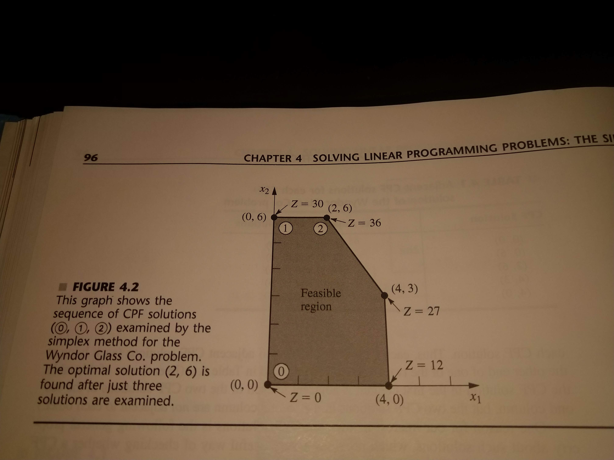

# Standard Form

 - Maximisation Problem
 - All Constraints <=
 - Non negative constraints on all variables.

The key to the efficiency of the simplex algorithm is that it only needs to find a Corner Point Feasible (CPF) solution
that has no adjacent CPF solutions that are better. Most of what simplex does is follow the edges towards the CPFs that
maximize Z. 

## Initial Table


This is just a specific form of


## Standard Form

Maximize: 
```
Z = 3x1 + 5x2 
```

Subject to:
```
x1        <= 4
      2x2 <= 12
3x1 + 2x2 <= 18
```

And: 
```
x1 >= 0, x2 >= 0
```

# Constraint Boundary

 - Is a line that forms the boundary of what is permitted by the corresponding constraint.
 
# Corner Point Solutions

## Feasible

 - Lie on the feasible region.

## Infeasible

 - Lie outside the feasible region.
 


 

# Definition Of Slack Variables

## Slack Variables

```
x1 <= 4
```

The slack variable for this constraint is defined to be:

```
x3 = 4 - x1
```

Which is the amount of slack in the left hand of the inequality. Thus,

```
x1 + x3 = 4
```

Given this equation, `x1 <= 4` if and only if `4 - x1 = x3` itself is `>= 0`

I.e. if `x1 = 3` then `4 - 3 = 1` which is `>= 0`

## Resulting Augmented Form

The augmented form uses slack variables to express the constraints as equalities as opposed to inequalities.

Maximise

```
Z = 3x1 + 5x2
```

Subject To

```
x1         + x3           = 4
      2x2        + x4     = 12
3x1 + 2x2             +x5 = 18
``` 

And 

```
xj >= 0, for j = 1,2,3,4,5
```


The solution for this problem is:

```
Z=36 with x1 = 2 and x2 = 6
```

