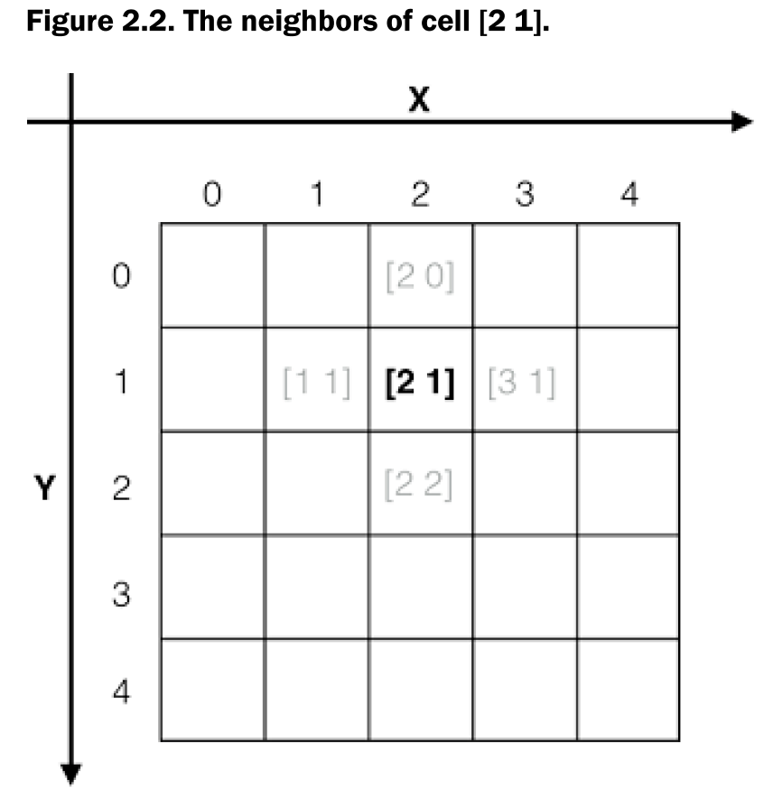

# Christmas Functional Special 

---

## Key Functional Language Concepts For Me

 - Function Composition
 - Referential Transparency
 - Laziness
 - Immutability

### Function Composition

Create first class functions bound to variables as composition of other functions. 

#### In Maths You Might See

```
h(x) = g(f(x))
```

#### FSharp

```fsharp
let add n x = x + n
let times n x = x * n
let add1Times2 = add 1 >> times 2
let add5Times3 = add 5 >> times 3

//test
add5Times3 10

>> 45
```

#### Clojure

```clojure
(def add   (fn [x y] (+ x y)))
(def times (fn [x y] (* x y)))

(def add-5-times-3
  (comp
    (partial times 3)
    (partial add 5)))

(add-5-times-3 10)
```

## Referential Transparency

In functional programming, referential transparency is generally defined as the fact that an expression, in a program, may be replaced by its value (or anything having the same value) without changing the result of the program. This implies that methods should always return the same value for a given argument, without having any other effect. This functional programming concept also applies to imperative programming, though, and can help you make your code clearer.

This means if the result of a function will always be the same given the same inputs
it doesn't matter when you evaluate it. Which leads into laziness...

---

## Lazyness 

Many mainstream functional programming languages are evaluated in a lazy first fashion:
 - Haskell
 - Clojure

Some other mainstream functional languages are eager by default
 - FSharp
 - OCaml
 
Some Object Orientated languages like Scala and Java offer forms of Lazy evaluation.


## Consume Multiple Collections

### Java 9+

```java
List<Integer> listA = List.of(1,2,3);
List<Integer> listB = List.of(4,5,6);
List<Integer> listC = List.of(2,3,4);
List<Integer> result = new ArrayList<>(3);
for (int count = 0; count < 3; count ++) {
    result.add(listA.get(count) + listB.get(count) + listC.get(count));
}
System.out.println(result);
```

[7, 10, 13]

### FSharp

```fsharp
let list1 = [1; 2; 3]
let list2 = [4; 5; 6]
let list3 = [2; 3; 4]
let newList = List.map3 (fun x y z -> x + y + z) list1 list2 list3
printfn "%A" newList
```

[7; 10; 13]

### Clojure

```clj
(def list1 [1 2 3])
(def list2 [4 5 6])
(def list3 [2 3 4])
(println (map + list1 list2 list3))
```

(7 10 13)

---

## Taking it Further Function Application

What if we were to have 'n' collections how would you go about performing this sum. 

### Java

```java
public class App2 {
    public static void main(String[] args) {
        List<Integer> listA = List.of(1,2,3);
        List<Integer> listB = List.of(4,5,6);
        List<Integer> listC = List.of(2,3,4);
        List<Integer> listD = List.of(400, 600, 700);
        List<Integer> listE = List.of(800, 900, 765);

        List<List<Integer>> toProcess = List.of(listA, listB, listC, listD, listE);
        List<Integer> result = new ArrayList<>(3);

        for (int index = 0; index < listA.size(); index ++) {
            Integer columnSum = 0;
            for (List<Integer> list : toProcess) {
                // The key bit is here the rest is ceremony.
                columnSum += list.get(index);
            }
            result.add(columnSum);
        }
        System.out.println(result);
    }
}
```

[1207, 1510, 1478]

### Clojure

```clj
(apply mapv + [[1 2 3] [4 5 6] [2 3 4]])
```

[7 10 13]

```clj
(apply mapv + [[1 2 3] [4 5 6] [2 3 4] [400 600 700] [800 900 765]])
```

[1207 1510 1478]

#### An aside on apply

```
Clojure is a dialect of Lisp and Lisp is an old language (the original paper "Recursive Functions of
Symbolic Expressions and Their Computation by Machine" is dated 1960, but research in the direction of
a new language for symbolic expression started around 1957). Initially Lisp adopted a syntax based on
M-expressions, or meta-language expressions, that was not based on lists (as it is now) and looked
something similar to:

λ[[y;z];cons[car[y];cdr[z]]]

The above is a function of two list arguments y,z that produces a new list as output merging (first
y) and (last z) equivalent to (fn [y z] (cons (first y) (last z))) in Clojure.
Sometimes between 1958 and 1959, McCarthy wanted to prove that Lisp was better at expressing
computability than the formalism of the Turing Machine. Part of that challenge was also to define an
"universal Lisp function", a function able to parse and execute another copy of itself written with the
same syntax (exactly like the universal Turing Machine is able to accept a definition of itself).
McCarthy had to find a way to express Lisp functions in a form that could be digested by Lisp itself
and decided to encode them in lists, using the convention that the first element of the list was the name
of the function and the rest of the list the parameters. McCarthy called this new notation an S-expression
(where S stands for Symbolic). The above "cons" M-expression would look like the following as an S-
expression (which is perfectly valid modern Lisp):

(LAMBDA (Y Z) (CONS (CAR Y) (CDR Z)))

The universal function that was able to parse S-expressions and apply them to arguments was called
indeed apply. McCarthy envisioned apply purely for research with no practical scope, until Steve Russel
(one of his graduates) decided to implement apply in machine language, effectively creating the first
Lisp REPL.
```

---

## Map Indexed

In functional languages some times you still need an index to make decisions on as you iterate.

This is a contrived example of how this index can be supplied. In the simplex example I'll show more
useful scenarios.

```clojure
(map-indexed
           (fn [index element]
             (* index element)) [1 2 3 4 5])
```

=> (0 2 6 12 20)

---

## Zip Map

Useful for dynamically generating maps

```clojure
(zipmap [:a :b :c] [1 2 3])
=> {:a 1, :b 2, :c 3}
```

```clojure
(require '[clojure.java.io :as io]) 
(require '[clojure.string :as s])

(def file-content
"TITLE,FIRST,LAST,NUMBER,STREET,CITY,POST,JOINED 
Mrs,Mary,Black,20,Hillbank St,Kelso,TD5 7JW,01/05/2012 12:51
Miss,Chris,Bowie,44,Hall Rd,Sheffield,S5 7PW,01/05/2012 17:02 
Mr,John,Burton,41,Warren Rd,Yarmouth,NR31 9AB,01/05/2012 17:08")

(defn split [line]
  (s/split line #","))

(defn transform [data]
   (let [lines (line-seq data)
         headers (split (first lines))]
      (eduction 
        (map split) 
        (map (partial zipmap headers))
        (rest lines)))

(with-open [data (io/reader (char-array file-content))]
  (doall (transform data)))

;; ({"TITLE" "Mrs", "FIRST" "Mary", "LAST" "Black", "NUMBER" "20", "STREET" "Hillbank St", "CITY" "Kelso", "POST" "TD5 7JW", "JOINED" "01/05/2012 12:51"} 
;;  {"TITLE" "Miss", "FIRST" "Chris", "LAST" "Bowie", "NUMBER" "44", "STREET" "Hall Rd", "CITY" "Sheffield", "POST" "S5 7PW", "JOINED" "01/05/2012 17:02"} 
;;  {"TITLE" "Mr", "FIRST" "John", "LAST" "Burton", "NUMBER" "41", "STREET" "Warren Rd", "CITY" "Yarmouth", "POST" "NR31 9AB", "JOINED" "01/05/2012 17:08"})
```

---

## Walk

 - Used to traverse nested structures like trees.

### Clojure
 
```clojure
(def wee-tree [[1 2 3]
               [4 5 6]])

;; Depth First Post
(w/postwalk #(do (println "visiting:" %) %) wee-tree)

visiting: 1
visiting: 2
visiting: 3
visiting: [1 2 3]
visiting: 4
visiting: 5
visiting: 6
visiting: [4 5 6]
visiting: [[1 2 3] [4 5 6]]

;; Depth First Pre
(w/prewalk  #(do (println "visiting:" %) %) wee-tree)

visiting: [[1 2 3] [4 5 6]]
visiting: [1 2 3]
visiting: 1
visiting: 2
visiting: 3
visiting: [4 5 6]
visiting: 4
visiting: 5
visiting: 6

(def mid-tree [[1 2 3
                  [5 6 7]]
               [4 5 6
                  [10 13 14]]])

(w/postwalk (fn [x]
              (if (number? x)
                (* 2 x)
                x))
            mid-tree)
[[2 4 6 
    [10 12 14]] 
 [8 10 12 
    [20 26 28]]]
``` 

### FSharp

Lovely Types

```fsharp
type Tree<'a> = 
  | Empty
  | Node of value: 'a * left: Tree<'a> * right: Tree<'a>

let traverse (tree : Tree<'a>) =
  let rec loop (tree : Tree<'a>) = seq {
    match tree with
    | Empty -> ()
    | Node (value, left, right) ->
      yield value

      yield! loop left
      yield! loop right
  }
  
  loop tree

let tree = 
  Node (1, 
    Node (2, 
      Node (4, Empty, Empty), 
      Node (5, Empty, Empty)), 
    Node (3, 
      Node (6, 
        Node (7, Empty, Empty),
        Empty), 
      Node (8, Empty, Empty)))

//       1
//    /     \
//   2       3
//  / \     / \
// 4   5   6   8
//        /
//       7
traverse tree |> Seq.iter (printfn "%d") // 1 2 4 5 3 6 7 8
```

## Juxt

juxt takes an argument list of functions and returns a new "juxtaposing" function that applies each original function to the same set of arguments. All results are then collected in a vector. juxt could be described as a "function multiplexer" since it calls multiple functions to return multiple result. 

```clojure
((juxt first second last) (range 10))

;; [0 1 9]
```



### Clojure

```clojure
(def dim #{0 1 2 3 4})

(defn up    [[x y]] [x (dec y)])
(defn down  [[x y]] [x (inc y)])
(defn left  [[x y]] [(dec x) y])
(defn right [[x y]] [(inc x) y])

(defn valid? [[x y]]
  (and (dim x) (dim y)))

(defn neighbors [cell] 
  (filter valid? 
    ((juxt up down left right) cell)))

(neighbors [2 1])
;; ([2 0] [2 2] [1 1] [3 1])

(neighbors [0 0])
;; ([0 1] [1 0])
```

## Memoize

memoize generates a function that stores the results of an existing one using the argument values as key.

trading space for time

```clojure                                     
(defn- f* [a b] 
  (println (format "Cache miss for [%s %s]" a b))
  (+ a b))

(def f (memoize f*))

(f 1 2)
;; Cache miss for [1 2] 
;; 3

(f 1 2)
;; 3

(f 1 3)
;; Cache miss for [1 3] 
;; 4
```

#### Larger Example Spell Check Suggestions 

```
"Elapsed time: 906.899211 msecs"
=> (["achieve" 1] ["active" 1] ["ache" 2])
"Elapsed time: 0.744617 msecs"
=> (["achieve" 1] ["active" 1] ["ache" 2])
```

## Simplex


```
Max Simple 2 Variable - Drugs and Machines
==========================================

A company produces drugs A and B using machines M 1 and M 2.
- 1 ton of drug A requires 1 hour of processing on M1 and 2 hours on M2
- 1 ton of drug B requires 3 hours of processing on M1 and 1 hour on M2
- 9 hours of processing on M1 and 8 hours on M2 are available each day
- Each ton of drug produced (of either type) yields £1 million profit

x 1 = number of tons of A produced
x 2 = number of tons of B produced

Maximise:
x1 + x2 (profit in £ million)

Subject To:
x1 + 3x2 <= 9 (M1 processing)
2x1 + x2 <= 8 (M2 processing)
x1, x2 > 0
``` 

